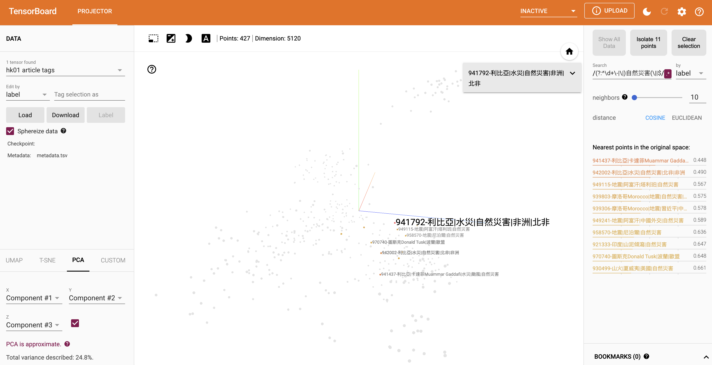

# KNN Tag suggestion based on embedding by llm

## Intro

Use similarity search to find the tags of existing top K similar articles, and return the tags with top occurrence.


## Init data

### 1. init db

run `examples/src/article-tag-suggestion/db/init.sql` in your db

### 2. fetch articles

```sh
cd examples
mkdir src/article-tag-suggestion/raw/articles
yarn tsx ./src/article-tag-suggestion/fetchData.ts
```

### 3. init store

setup ollama host conf in `examples/src/article-tag-suggestion/initVectorStore.ts`
setup db conf in `examples/src/article-tag-suggestion/db/pool.ts` then:

```sh
yarn tsx ./src/article-tag-suggestion/initVectorStore.ts
```

## 4. Try suggestion

setup ollama host conf in `examples/src/article-tag-suggestion/playground.ts`

```sh
yarn tsx ./src/article-tag-suggestion/playground.ts
```

## Evaluation

setup ollama host conf in `examples/src/article-tag-suggestion/evaluate.ts`

```sh
yarn tsx ./src/article-tag-suggestion/evaluate.ts
```

### Results

```text
accuracy: 0.9215686274509803
avg precision: 0.423236914600551
avg recall: 0.46728650137741046
f1 score: 0.4441722553926775
```

## Visualization

10 neighbors of the target article, setup can be found [here](https://github.com/kpkonghk01/tensorflow-learn/blob/main/tensorboard/tensorboard.ipynb)




## Logs

```text
ArticleId: 967947
predicted tags: [中國經濟, 韓國, 內房股]
actual tags: [中國經濟]

ArticleId: 971761
predicted tags: [中國經濟, 百貨公司, 中國經濟數據]
actual tags: [中國經濟, 中國經濟數據]

ArticleId: 971894
predicted tags: [電影消息, 劉德華, 潛行]
actual tags: [電影消息, 潛行, 劉德華]

ArticleId: 970554
predicted tags: [電影消息, 潛行, 劉德華]
actual tags: [電影消息, 金手指]

ArticleId: 970319
predicted tags: [二手樓成交, 本地樓市, 美孚新邨]
actual tags: [本地樓市, 二手樓成交, 東區樓市, 蝕讓盤]

ArticleId: 954036
predicted tags: [香港天文台, 天氣, 東北季候風]
actual tags: [香港天文台]

ArticleId: 961840
predicted tags: [香港天文台, 天氣, 東北季候風]
actual tags: [香港天文台]

ArticleId: 970952
predicted tags: [電影消息, 阿飛正傳, 林超榮]
actual tags: [電影消息, 林超榮]

ArticleId: 971957
predicted tags: [電影消息, 吉卜力工作室, 宮崎駿]
actual tags: [電影, 電影消息, 宮崎駿, 吉卜力工作室]

ArticleId: 967954
predicted tags: [手機, 智能手機, 手機新聞]
actual tags: [手機, 智能手機, 手機新聞, Apple, iPhone]

ArticleId: 969085
predicted tags: [本地樓市, 二手樓成交, 樓市預測]
actual tags: [本地樓市, 二手樓成交, 林奮強, 油尖旺區樓市]

ArticleId: 964946
predicted tags: [手機, 智能手機, 手機新聞]
actual tags: [手機, 智能手機, 手機新聞, 詐騙]

ArticleId: 971731
predicted tags: [歐盟, 俄烏戰爭, 中歐關係]
actual tags: [歐盟]

ArticleId: 964869
predicted tags: [手機, 智能手機, 手機新聞]
actual tags: [手機, 智能手機, 手機新聞]

ArticleId: 962221
predicted tags: [手機, 智能手機, 手機新聞]
actual tags: [手機, Apple, iPhone, Apps, iPad, Apple Watch, Mac]

ArticleId: 970183
predicted tags: [二手樓成交, 本地樓市, 美孚新邨]
actual tags: [蝕讓盤, 二手樓成交, 本地樓市, 屯門區樓市]

ArticleId: 930966
predicted tags: [ACG, 日本動畫, 動漫多媒體]
actual tags: [動漫多媒體, 動漫, ACG, 日本漫畫, 鬼滅之刃（漫畫作品）, 少年Jump, 漫畫]

ArticleId: 967986
predicted tags: [中國外交, 韓國, 中國經濟]
actual tags: [Honda, 中國經濟, 電動車, Toyota, 比亞迪, 三菱汽車]

ArticleId: 958437
predicted tags: [自然災害, 廣東, 福建]
actual tags: [地震, 香港天文台, 廣東]

ArticleId: 971781
predicted tags: [電影消息, 張家輝, 張慧儀]
actual tags: [電影消息, 許光漢, 惠英紅, 張鈞甯]

ArticleId: 911412
predicted tags: [手機, 智能手機, 手機新聞]
actual tags: [東京自由行, 秋葉原, Uniqlo, 東京, 東京, 日本旅遊, 日本, 日本, 旅遊購物情報, 購物, 商場, 旅遊熱話, 打卡, 景點, 旅遊, 動漫, LIVE JAPAN, 旅遊Jetso]

ArticleId: 971810
predicted tags: [電影消息, 潛行, 劉德華]
actual tags: [電影消息, 白日之下]

ArticleId: 963802
predicted tags: [手機, 智能手機, 手機新聞]
actual tags: [三星Samsung, 手機, 智能手機, 手機新聞, 中關村在線]

ArticleId: 971320
predicted tags: [中國經濟, 中國房地產市場, 中國工業企業利潤]
actual tags: [惠譽, 中國經濟, 中國經濟數據, 中國房地產市場, 內地樓市, 地方債]

ArticleId: 953599
predicted tags: [香港天文台, 天氣, 東北季候風]
actual tags: [香港天文台, 重陽節]

ArticleId: 957445
predicted tags: [天氣, 香港天文台]
actual tags: [天氣, 香港天文台]

ArticleId: 958626
predicted tags: [天氣, 香港天文台]
actual tags: [天氣, 香港天文台]

ArticleId: 971547
predicted tags: [手機, 智能手機, 手機新聞]
actual tags: [Redmi, 小米, 手機, 智能手機, 手機新聞, Mobile Magazine]

ArticleId: 953199
predicted tags: [天氣, 香港天文台, 01 Video]
actual tags: [天氣, 香港天文台]

ArticleId: 958555
predicted tags: [香港天文台, 東北季候風, 天氣]
actual tags: [香港天文台, 冷鋒]

ArticleId: 970170
predicted tags: [中國經濟, 利比亞, 卡達菲Muammar Gaddafi]
actual tags: [AI人工智能, 歐盟, 美國, 中國外交]

ArticleId: 972324
predicted tags: [本地綜藝節目, 亞洲超星團, Rain]
actual tags: [本地綜藝節目, 亞洲超星團]

ArticleId: 971871
predicted tags: [電影消息, Netflix, 電影]
actual tags: [小島秀夫, 電影消息]

ArticleId: 959064
predicted tags: [香港天文台, 天氣, 東北季候風]
actual tags: [香港天文台]

ArticleId: 932127
predicted tags: [自然災害, 中國水災, 水災]
actual tags: [極端天氣, 自然災害, 四川]

ArticleId: 960947
predicted tags: [天氣, 香港天文台]
actual tags: [天氣, 香港天文台]

ArticleId: 969916
predicted tags: [颱風, 自然災害, 熱話]
actual tags: [谷愛凌, AI人工智能, 矽谷, 哈佛大學, 外灘, 中國經濟, 熱話]

ArticleId: 968477
predicted tags: [中國經濟, 中國外交, 韓國]
actual tags: [中國經濟, 穆迪]

ArticleId: 968696
predicted tags: [手機, 智能手機, 手機新聞]
actual tags: [手機, 智能手機, 手機新聞, Apple, iPhone, iPhone 15]

ArticleId: 971982
predicted tags: [手機, 智能手機, 手機新聞]
actual tags: [手機, 智能手機, 手機新聞, 無合約 SIM]

ArticleId: 970765
predicted tags: [電影消息, 電影, Netflix]
actual tags: [電影, 電影消息, Disney+]

ArticleId: 971733
predicted tags: [手機, 智能手機, 手機新聞]
actual tags: [手機, 智能手機, 手機新聞, Android, Android產品, vivo]

ArticleId: 930228
predicted tags: [颱風, 自然災害, 卡努風球]
actual tags: [颱風, 日本, 極端天氣, 自然災害]

ArticleId: 970770
predicted tags: [中國經濟, 百貨公司, 中國工業企業利潤]
actual tags: [中國經濟, 中國股市, 內地股市, 言論自由]

ArticleId: 970579
predicted tags: [中國經濟, 內房股, 華爾街]
actual tags: [中國經濟, 中國經濟數據]

ArticleId: 971658
predicted tags: [電影, 電影消息, 高海寧]
actual tags: [電影, 電影消息, 薩克薛達]

ArticleId: 916792
predicted tags: [動漫, 日本動畫, AI人工智能]
actual tags: [網上熱話, 動漫]

ArticleId: 972363
predicted tags: [電影消息, 周海媚, 電影]
actual tags: [吳千語, 香港藝人動向, 01 Video, OTT, 娛樂無窮, 01‌ ‌Video‌ ‌OTT]

ArticleId: 970559
predicted tags: [香港天文台, 東北季候風, 天氣]
actual tags: [天氣, 香港天文台, 上水]

ArticleId: 932016
predicted tags: [電影消息, 周海媚, 手機]
actual tags: [網上熱話, 動漫]

ArticleId: 969402
predicted tags: [中歐關係, 歐盟, 習近平]
actual tags: [中歐關係, 李強, 歐盟, 馮德萊恩]
```
